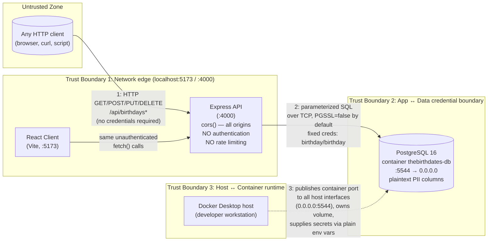

# Threat Model — Birthday Memory

**Track:** B — Application Security
**Scope:** Local fork only (`security-hardening-appsec` branch), bound to `127.0.0.1`/`localhost`, synthetic seed data.
**Author:** Alec, incoming Security Engineer (per the CISO memo framing)
**Date:** 2026-09-22

This threat model is produced *before* any remediation, per the assignment's requirement to model
before patching. It is based on direct review of `server/src/index.js`, `routes.js`, `db.js`,
`validate.js`, `dates.js`, `seed.js`, and `docker-compose.yml` as they exist on the unmodified
`main` branch (see `docs/assessment/config-snapshots/`).

---

## 1. Data Flow Diagram

Three components, two network hops, and one credential boundary. There is currently no
authentication anywhere in this system, so the diagram below is drawn as it *actually behaves
today* — every arrow crossing the Client → API boundary carries no identity or authorization
context at all.

**Boundary 1 — Network edge (anyone → API).** This is the boundary the CISO memo is most worried
about: nothing distinguishes a legitimate teammate from an anonymous script. `cors()` with no
options means any web origin can also script against this API from a victim's browser.

**Boundary 2 — API → Database.** The API holds a single, fixed set of database credentials
(fallback-hardcoded in `db.js`, restated in `docker-compose.yml`) and uses them identically no
matter who the original caller was — there is no per-user database identity, so the database
cannot distinguish or restrict by caller either. Query construction is parameterized (see
Implementation notes in the API hardening section once testing confirms this), but the *transport*
to the database defaults to unencrypted (`PGSSL=false`), and even the opt-in TLS path
(`rejectUnauthorized: false`) does not validate the server certificate.

**Boundary 3 — Host → Container runtime.** The Postgres container publishes its port to
`0.0.0.0` (all interfaces) rather than `127.0.0.1` only, receives its credentials as plain
environment variables in a tracked `docker-compose.yml`, uses a floating tag (`postgres:16-alpine`,
not a pinned digest), and has no resource limits, no read-only root filesystem, and no explicit
non-root user directive.

---

## 2. STRIDE Analysis

Applied per boundary above. Each row states what the property violation would look like in *this*
specific app, not a generic definition. "Status" reflects what's evident from code review — each
one still needs to be actively tested (Domain-by-domain testing phase) before being written up as a
confirmed finding; this table is the hypothesis set testing will confirm or rule out.

### Boundary 1 — Client / any caller → API

| STRIDE category | Concrete threat in this app | Status (pre-test) |
|---|---|---|
| **S**poofing | N/A in the classic sense — there is no identity to spoof, because there is no identity at all. The real issue is one layer up: nothing *requires* an identity in the first place. | Root cause of everything else below |
| **T**ampering | Any caller can `PUT`/`DELETE` any record by ID with no ownership check — a stranger can edit or delete someone else's birthday entry. | Likely — needs live test |
| **R**epudiation | No request logging beyond generic Express console output; no audit trail ties a create/update/delete to any caller (there's no caller identity to log in the first place). If data is altered or deleted, there is no way to determine who did it. | Confirmed by code review (no logging middleware, no user field on any table) |
| **I**nformation Disclosure | Full PII (name, DOB, phone, email) for every record is returned to any caller via `GET /api/birthdays` with no filtering by identity. | Likely — needs live test |
| **D**enial of Service | `/api/birthdays` and `/api/birthdays/upcoming` return the entire table with no pagination or row limit, and there is no rate limiting on any route. A caller can hammer these endpoints or (at larger data volumes) trigger expensive unbounded scans. | Confirmed by code review; controlled proof-of-concept only, per assignment safety rails |
| **E**levation of Privilege | Not directly applicable — there are no privilege tiers in the app at all, which is itself the underlying problem: every caller already has the highest privilege the app offers. | Root cause, same as Spoofing row |

### Boundary 2 — API → Database

| STRIDE category | Concrete threat | Status (pre-test) |
|---|---|---|
| **S**poofing | The API always authenticates to Postgres as the same fixed `birthday` role, regardless of caller — the database cannot distinguish or reject based on the original HTTP requester. | Confirmed by code review |
| **T**ampering | If the fixed DB credentials were ever obtained (e.g., from the tracked `docker-compose.yml`), an attacker with network access to port 5544 could bypass the API entirely and modify data directly. | Confirmed reachable (`docker compose ps` shows 5544 published to `0.0.0.0`) |
| **R**epudiation | Same as above — no per-caller identity reaches the database layer, so DB-level audit (if enabled) still couldn't attribute actions to an end user. | Confirmed by code review |
| **I**nformation Disclosure | Default transport is unencrypted (`PGSSL=false`); if enabled, `rejectUnauthorized: false` still allows a MITM to present any certificate. On localhost this is low-severity today, but the *default* configuration is what would ship if this were pointed at a remote/managed Postgres instance without changes. | Confirmed by code review |
| **D**enial of Service | The single shared connection pool has no configured max/min bounds visible in code beyond `pg`'s defaults; combined with unbounded queries from Boundary 1, a flood of requests could exhaust pool connections. | Plausible, needs load-style proof-of-concept (small, controlled per safety rails) |
| **E**levation of Privilege | The `birthday` role is used for both schema DDL (`CREATE TABLE`, `CREATE EXTENSION`) at startup and ordinary CRUD DML at runtime — the app's day-to-day connection has far more privilege than it needs after schema init. | Confirmed by code review (`initSchema()` runs on every app start with the same runtime credentials) |

### Boundary 3 — Host → Container runtime

| STRIDE category | Concrete threat | Status (pre-test) |
|---|---|---|
| **S**poofing | N/A — no service identity/mTLS between host and container; not a meaningful concern for a single local Postgres container. | Not applicable |
| **T**ampering | Floating image tag (`postgres:16-alpine`) means the exact image content can change between pulls with no integrity pinning (no digest, no SBOM, no image signature verification). | Confirmed by code review |
| **R**epudiation | No container-level audit logging configured. | Confirmed by code review |
| **I**nformation Disclosure | Port 5544 published to `0.0.0.0`/`[::]` (all interfaces) rather than `127.0.0.1` only means any other device on the same network segment — not just this machine — could reach Postgres directly if the host firewall doesn't block it. | Confirmed via `docker compose ps` output in baseline capture |
| **D**enial of Service | No CPU/memory limits set on the `postgres` service — an unbounded query (Boundary 1/2) could also exhaust host resources with nothing to cap the container's consumption. | Confirmed by code review |
| **E**levation of Privilege | No explicit `user:` directive, no `read_only: true`, no `security_opt` / `cap_drop` — the container runs with Docker's defaults rather than a hardened runtime profile. | Confirmed by code review |

---

## 3. Asset Inventory

| Asset | Description | Sensitivity | Where it lives | Notes |
|---|---|---|---|---|
| **Birthday records** (`first_name`, `last_name`, `birthdate`, `phone`, `email`) | The core dataset — full name, date of birth, phone number, and email address per person | **High.** This is a complete identity/social-engineering starter kit even without a government ID or financial data attached — matches the CISO memo's framing directly. | `birthdays` table, PostgreSQL, plaintext columns, no encryption at rest | This is the asset the entire assessment protects. Regulatory applicability (see below) depends on whether real people's data is ever entered — for this assessment it never is (synthetic only), but production use would involve real people. |
| **Database credentials** | `PGUSER`/`PGPASSWORD` (`birthday`/`birthday`) | **Medium** as configured (weak, default, and tracked in git) — would be **High** if these were ever reused for a real deployment | `docker-compose.yml` (tracked), `db.js` fallback literal (tracked), `.env` (gitignored, not tracked) | The *actual* runtime `.env` is properly gitignored — the exposure is that the tracked files ship the same weak defaults, so nothing meaningfully differs from the "real" credentials in this dev setup. |
| **Record IDs (UUIDs)** | Primary keys for each birthday record | **Low.** UUIDv4-style, not sequential/guessable, so they don't materially aid enumeration on their own. | Returned in every API response | Not a sensitive asset by itself, but relevant to Domain 1 since `PUT`/`DELETE` trust the ID alone with no ownership check. |
| **Application source code / configuration** | The codebase itself, including this assessment's own evidence | **Low–Medium.** Nothing secret by design, but the repo is public once forked, so anything committed here is public. | GitHub (public fork) | Governs the "don't leak your own secrets" rule — anything committed here must never include a real credential, even accidentally. |
| **PostgreSQL container / volume** | The running database engine and its persistent Docker volume | **Medium.** Compromise of the container or host-level access to the volume exposes the entire dataset directly, bypassing the API and its (currently nonexistent) access controls entirely. | Docker Desktop, local volume `thebirthdates-data` | Volume persists across container restarts; anyone with Docker/host access can inspect it directly. |

### Regulatory surface to evaluate (not a legal conclusion — flagged for the board report's Regulatory section)

Name + date of birth + phone + email is "personal data" under a broad definition (e.g., GDPR
Art. 4) regardless of whether it also includes a government ID or financial account number. It is
**not** automatically the specific combination most U.S. state breach-notification statutes trigger
on (which typically require name plus a more sensitive identifier — SSN, driver's license, or
financial account number) — this needs to be verified against the specific states in scope before
the board report asserts a breach-notification obligation, rather than assumed. GDPR (if any data
subject is in the EU), CCPA/CPRA (if any data subject is a California resident, given the statute's
broad "personal information" definition even outside its narrower private-right-of-action trigger),
and general FTC Act Section 5 (unfair/deceptive practices, for a company holding PII with no
access controls at all) are the frameworks worth evaluating in detail during the report phase.

---

## 4. Prioritized Remediation Roadmap

**Ranking criteria** (stated explicitly, per the assignment's requirement to justify why the top
item outranks the second): each item is ranked primarily by (a) whether it is a **root-cause
enabler** that makes everything below it exploitable in the first place, versus a **defense-in-depth**
control that reduces damage *after* something else already went wrong; secondarily by (b) **ease of
exploitation** (zero skill/tooling required vs. requiring another precondition); and (c) **blast
radius** (the entire dataset vs. a partial/edge-case exposure). A defense-in-depth item never
outranks a root-cause item, even if the defense-in-depth item sounds individually scarier, because
fixing the root cause first is what makes every subsequent fix actually matter.

| Rank | Item | Domain | Why it's here |
|---|---|---|---|
| 1 | **No authentication or authorization on any endpoint** | API | Root-cause enabler for nearly every other row in the STRIDE table above. Zero skill required to exploit (a single `curl` reaches full CRUD on PII). Full blast radius — the entire dataset, every operation. Every other fix on this list is meaningfully less valuable until this is addressed, because an attacker who can't authenticate can't reach any of the data these other controls are meant to protect. |
| 2 | **Hardcoded/default database credentials tracked in git** (`docker-compose.yml`, `db.js` fallback) | Database | Second root-cause item — even after adding authentication to the API, a weak, tracked, predictable database credential is a direct bypass path straight to the data if the database port is ever reachable (which it currently is — see Rank item 4 below). Fixing this is low-effort relative to its risk reduction. |
| 3 | **Wide-open CORS (`cors()` with no origin restriction)** | API | Compounds Rank 1: once authentication exists, unrestricted CORS is what would let a malicious third-party site make authenticated-looking requests against the API from inside a legitimate user's browser. Ranked below 1–2 because, with zero authentication today, CORS is not currently the *primary* path to the data (the API already accepts unauthenticated requests directly) — its severity increases sharply once Rank 1 is fixed, which is exactly why it's addressed in the same wave rather than deferred. |
| 4 | **Postgres port published to all interfaces (`0.0.0.0:5544`) instead of `127.0.0.1`** | Container | This is what makes Rank 2's weak credentials reachable from beyond the local machine in the first place. Fixing the binding doesn't fix the weak credential, but it does shrink the exposure window while Rank 2 is being rolled out, and it's a one-line change. |
| 5 | **No rate limiting + unbounded queries (`/api/birthdays`, `/api/birthdays/upcoming`)** | API | A real availability risk, and explicitly called out in the assignment's own safety-rail language as the sanctioned way to demonstrate DoS conditions. Ranked below access-control items because a resource-exhaustion outcome is disruptive but not a confidentiality breach — the CISO memo's primary concern (identity-theft-grade data exposure) is fully addressed by Ranks 1–2 first. |
| 6 | **Plaintext PII storage / no encryption at rest** | Database | A genuine defense-in-depth control — valuable *in addition to* access control, not instead of it. Ranked here rather than higher because encrypting data that anyone can already read via Rank 1's missing auth provides limited real protection until Rank 1 is fixed; it becomes a meaningfully stronger control once access is actually restricted. |
| 7 | **TLS gaps to the database** (`PGSSL=false` default, `rejectUnauthorized:false` when enabled) | Database | Low real-world severity for a same-host local Postgres connection today, but a live footgun for any future deployment where API and database aren't co-located. Ranked last among "real" findings because it's the least immediately exploitable in the current topology. |
| 8 | **Container runtime hardening** (floating image tag, no resource limits, no non-root/read-only enforcement) | Container | Standard hardening hygiene rather than a direct path to the PII dataset. Worth doing as part of a complete remediation pass, but doesn't materially change the risk to the data itself the way Ranks 1–4 do. |

**Sequencing note:** Ranks 1–4 form the "stop the bleeding" wave — they directly close the path
from "anonymous internet request" to "full PII dataset." Ranks 5–8 are the "harden what's left"
wave, valuable but not urgent in the same way. This sequencing is carried forward into the board
report's Recommendations & Roadmap section.
